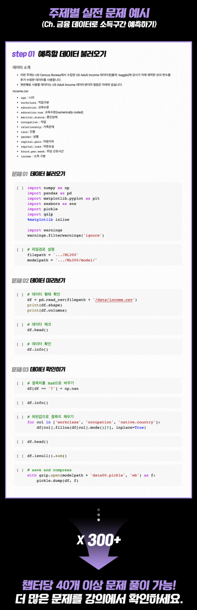

# Financial ML

패스트캠퍼스 [파이썬 머신러닝 300제+](https://fastcampus.co.kr/data_online_ml300) 수강생을 위한 배포용 데이터와 모델입니다.

금융 파트는 4개의 챕터로 구성되어 있습니다.

## Chapter 01. 금융 데이터로 소득 구간 예측하기

[/income](/income) 소득구간 예측을 위한 인구 데이터  

## Chapter 02. 설명가능한 머신러닝 (1) - 학습모델 개선하기

[/xai](/xai) 설명가능한 머신러닝 적용을 위한 기초 모델 

## Chapter 03. 설명가능한 머신러닝 (2) - 학습모델 해석하기

실습 노트에서 직접 데이터를 다운로드 받아 사용합니다.

## Chapter 04. 불균형 데이터를 이용하여 금융 사기탐지 모델 구현하기

[/fraud](/fraud) 사기탐지 예측을 위한 신용카드 소비 데이터 

## 그 외 참고자료

- 금융권 빅데이터 활용을 위한 R&D 전략, 2020 ([pdf](https://github.com/mchoimis/financialml/raw/main/financialbigdata.pdf))
- 피처 중요도 산출 방법론, SHAP 알고리즘의 비교 ([pdf](https://github.com/mchoimis/financialml/raw/main/featureimportance.pdf))
- 리샘플링(Resampling) 알고리즘 비교 ([pdf](https://github.com/mchoimis/financialml/raw/main/resampling.pdf))

## Announcement

각각의 데이터 출처는 강의에서 고지한 바와 같으며, 추후 변경이 있을시 안내 후 업데이트 하겠습니다.

